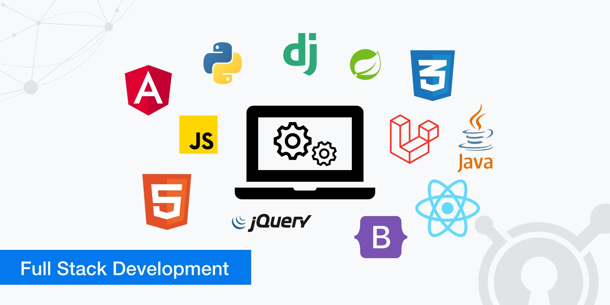

# Udacity Full Stack Web Developer 

This repository contains all projects and relevent exercise of the Udacity Full Stack Web Developer Nano-Degree

##### Courses

_1. Intro_

_2. SQL and Data Modeling for the Web_

_**Project: Fyyur**_

_3. API Development and Documentation_

_**Project: Trivia API**_

_4. Identity Access Management_

_**Project: Cofee Shop Full Stack**_

_5. Server Deployment and Containerization_

_**Project: Deploy Flask App to Kubernetes Using EKS**_

_6. Full Stack Capstone_

_**Project: Capstone**_

  

